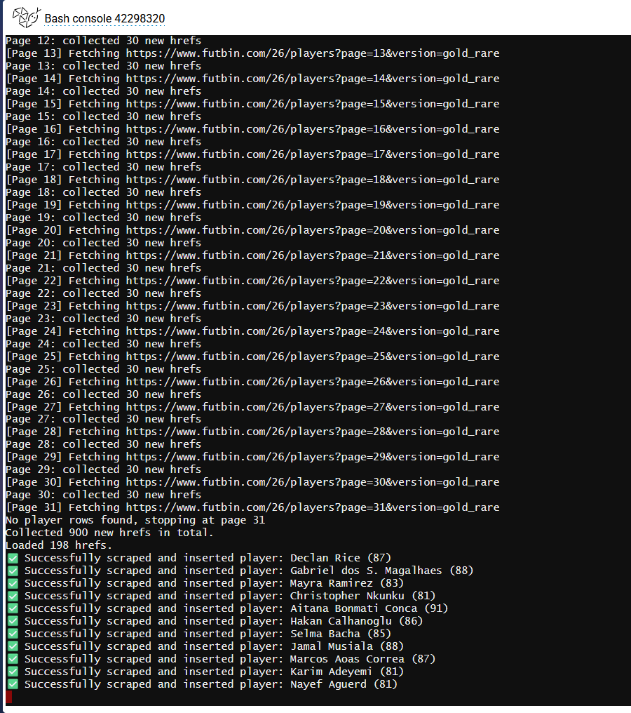
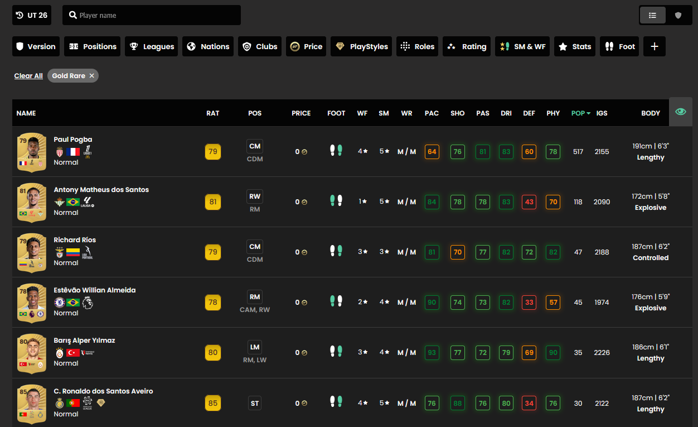
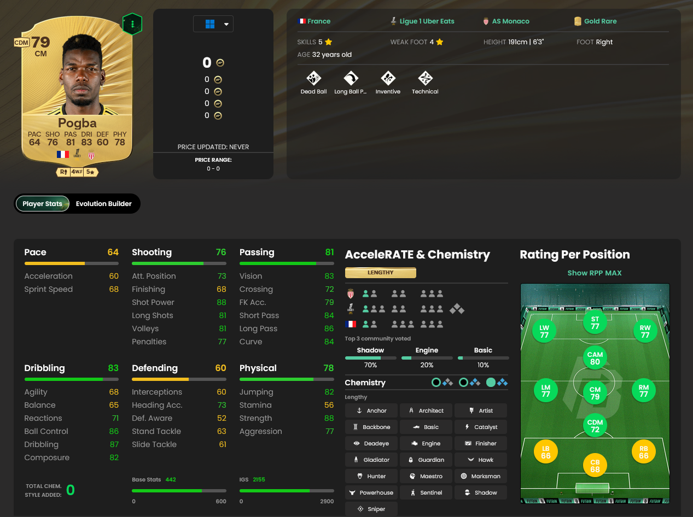
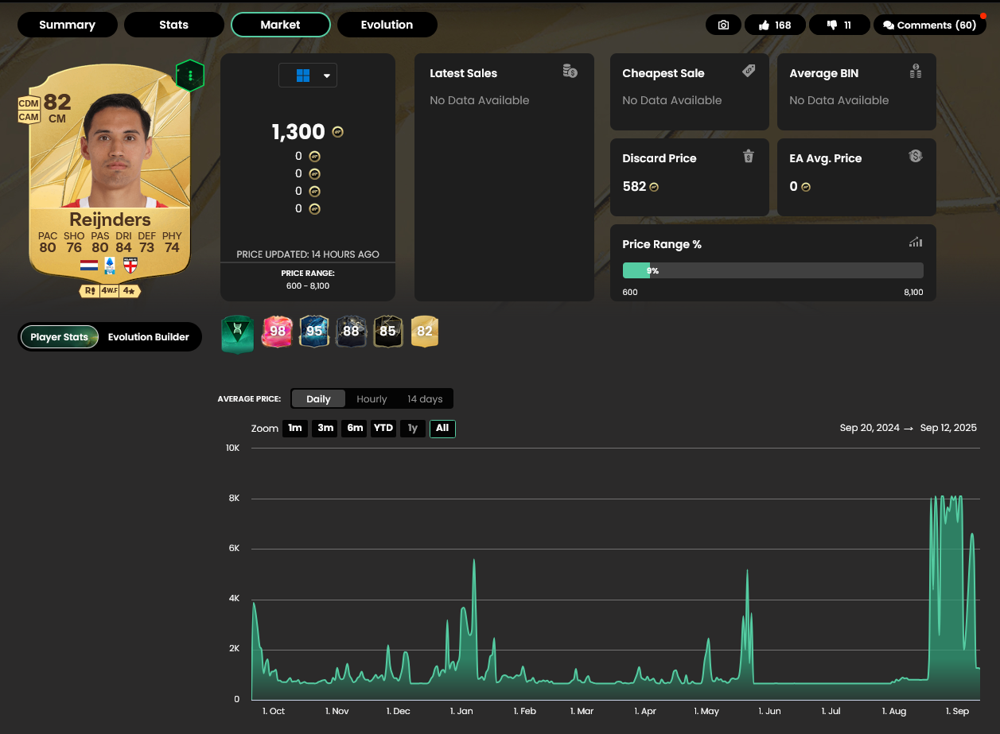
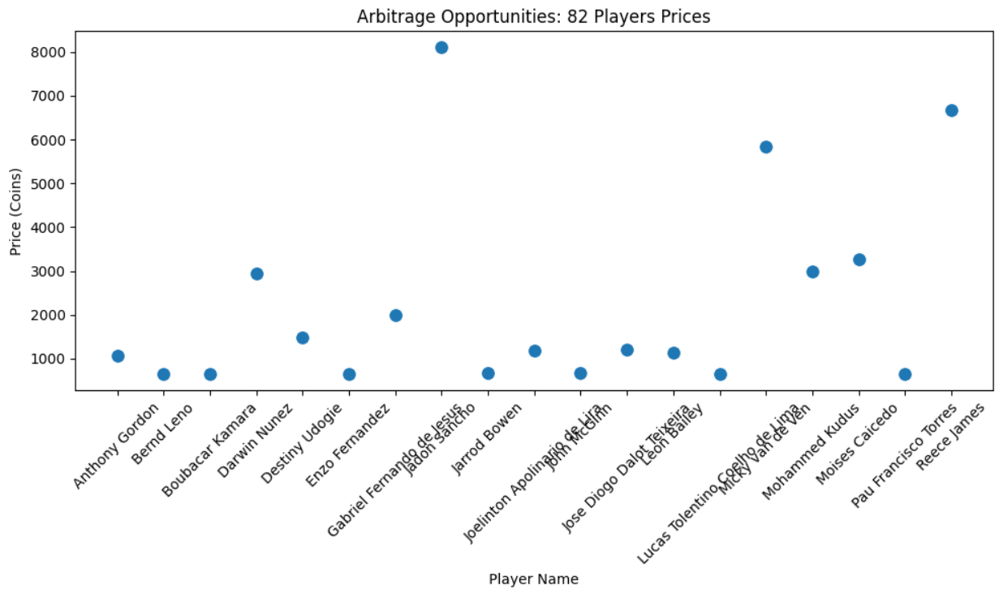
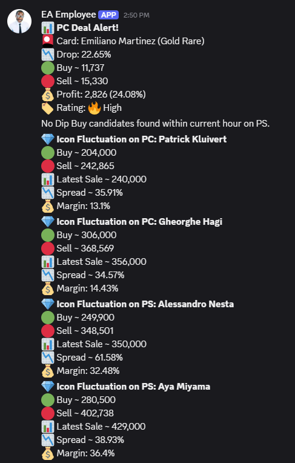

# **Data-Driven Trading Strategy Research on FIFA Market**

## Table of Contents

- [**Data-Driven Trading Strategy Research on FIFA Market**](#data-driven-trading-strategy-research-on-fifa-market)
  - [Table of Contents](#table-of-contents)
  - [Overview](#overview)
  - [**Data Scraping**](#data-scraping)
    - [Deployed Data Scraper Retrieve Steps](#deployed-data-scraper-retrieve-steps)
    - [Features](#features)
    - [Database Structure](#database-structure)
  - [**Feature Engineering**](#feature-engineering)
  - [**Strategy Design**](#strategy-design)
  - [**Backtesting \& Simulation**](#backtesting--simulation)
  - [**Live Execution**](#live-execution)
  - [Setup](#setup)
  - [Usage](#usage)
  - [Contributing](#contributing)
  - [License](#license)

---

## Overview

Briefly describe your project:

> This project collects and analyzes FIFA Ultimate Team (FUT) player market data to research and test trading strategies. It stores player stats, prices, playstyles, and historical trends in a PostgreSQL database.

## **Data Scraping**

---

### Deployed Data Scraper Retrieve Steps

1. Open PuTTy and load fifa settings
2. extract data on fc26_data.ipynb

/home/Shaninho/fifa_market_strategiser/venv/bin/python /home/Shaninho/fifa_market_strategiser/main_scraper.py



### Features



* Stores player attributes, stats, and historical price data.
* Tracks player playstyles and roles.
* Maintains pace, shooting, passing, dribbling, defending, and physical statistics.
* Supports historical tracking of player market values (PC and console).

---

### Database Structure

Database tables:

* **players** – Basic player info (name, rating, height, acceleration, etc.)
* **price\_history** – Tracks PC and console prices over time.
* **player\_playstyles** – Stores each player’s playstyle(s) and level.
* **player\_roles** – Stores positions and roles for each player.
* **player\_pace\_stats** – Pace-specific stats.
* **player\_shooting\_stats** – Shooting-specific stats.
* **player\_passing\_stats** – Passing-specific stats.
* **player\_dribbling\_stats** – Dribbling-specific stats.
* **player\_defending\_stats** – Defending-specific stats.
* **player\_physical\_stats** – Physical stats.

.png)

---

## **Feature Engineering**

Scatter Plot of 82 Rated Player Prices


## **ML Model Training**
## **Strategy Design**
## **Backtesting & Simulation**
## **Live Execution**



Implemented a discord bot for live deal alerts to compliment the trading strategies from live data


## Setup

Explain how to set up the project locally:

1. Clone the repository:

   ```bash
   git clone https://github.com/Shaninhooo/Data-Driven-Trading-Strategy-Research-on-FIFA-Market.git
   ```
2. Create a `.env` file with your PostgreSQL credentials:

   ```env
   DB_NAME=your_db_name
   DB_USER=your_username
   DB_PASSWORD=your_password
   DB_HOST=localhost
   DB_PORT=5432
   ```
3. Install dependencies:

   ```bash
   pip install -r requirements.txt
   ```
4. Run the Python script to initialize the database tables:

   ```bash
   python postgresConnect.py
   ```

---

## Usage

Explain how someone can use your database or scripts:

* Insert new player data.
* Query historical price trends.
* Analyze player statistics for trading strategies.

Example:

```python
cur.execute("SELECT * FROM price_history WHERE player_id = 1;")
```

---


---

