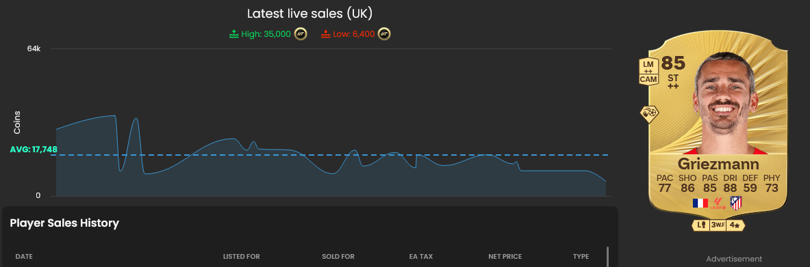
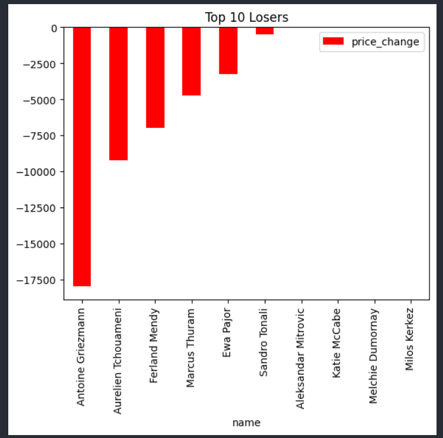
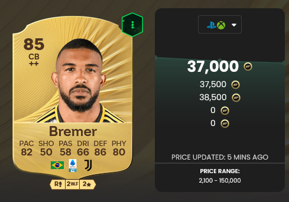
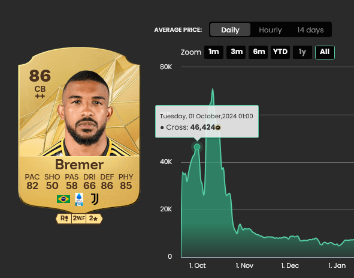
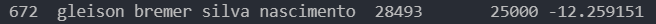

# EA FC 26 Player Card Investment Strategy Documentation

## Week 1

### **Griezmann**

Griezmann looks like a very good investment at 10k and after a big drop in price as Griezmann Was over 100k on EA FC 25

**Pros**:
- Has similar stats compared to EA FC 25
- Has a playstyle+
- Has 2 Role++
- Was 100k on EA FC 25 at this time and is right now approximately 10k 

**Cons**:
- Has under 80 pace
- Was 3 ratings higher in FC 25 (Less Rare / More Supply)
- Had Finesse Shot Playstyle+ much more meta compared to Chip playstyle+

### **Bremer**

pct_diff Caculation is only 12% different in price between the games

#### Bremer: Pros & Cons

**Pros**:
- Has very similar stats compared to FC 25
- Bremer spiked in price rapidly during start of weekend league in FC 25

**Cons**:
- Too early right now as game hasn't been released yet and people don't have coins
- Is sub 86 rated making Bremer not a walkout on FC 26 (Less Rare / More Supply)